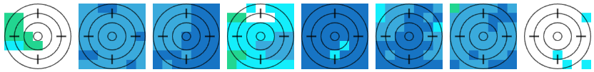

# rainSPOTjs



A Javascript library for generating meteoblue "rainSPOT" visualizations with SVG or Canvas

A "rainSPOT" is a neat visualization of localized precipitation data developped by meteoblue.com.

See: https://content.meteoblue.com/en/private-customers/website-help/7-day-weather/rainspot

---

# Please hold while i figure out how to publish this properly 😅

# Documentation will follow soon

## For now, have a [play with the DEMO](https://borisanthony.github.io/rainSPOTjs/)

---


## Installation

```sh
npm install rainSPOTjs
```

## Usage

rainSPOT provides two versions: SVG and Canvas. You can choose the one that best fits your needs.

### SVG Version
```javascript
import rainSPOTSvg from 'rainspot/svg';
```

### Canvas Version (PNG)
```javascript
import rainSPOTCanvas from 'rainspot/canvas';
```


## License
MIT